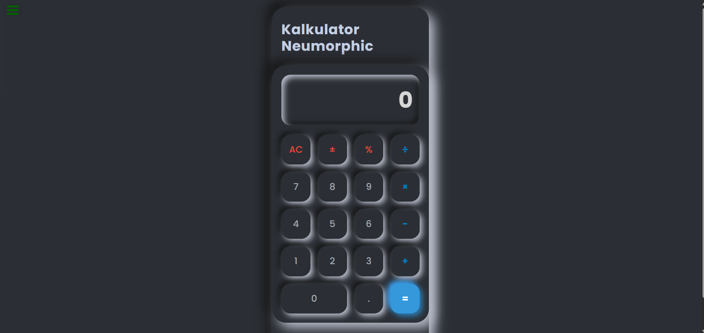

# 🧮 Kalkulator JavaScript

Aplikasi **Kalkulator JavaScript** interaktif yang dibangun dengan **React (via CDN)** dan **TailwindCSS**.  
Proyek ini merupakan implementasi dari [FreeCodeCamp Frontend Libraries Project](https://www.freecodecamp.org/learn/front-end-development-libraries/#front-end-development-libraries-projects).

✨ Fitur:
- Operasi dasar: `+`, `-`, `×`, `÷`
- Tombol **AC**, **±**, **%**, dan `=`
- Input angka desimal
- Keyboard support
- Desain **Soft UI / Neumorphic** yang modern dan interaktif
- Responsif di berbagai ukuran layar

---

## 🚀 Demo
👉 [Lihat Live Demo di GitHub Pages](https://ddekaee.github.io/calculatorJavaScript/)  

---

## 🛠️ Teknologi yang digunakan
- [React 18](https://react.dev/) via CDN (tanpa build tools)
- [TailwindCSS](https://tailwindcss.com/) untuk styling
- CSS custom untuk efek Neumorphic / Soft UI
- [FreeCodeCamp Test Suite](https://cdn.freecodecamp.org/testable-projects-fcc/v1/bundle.js)

---

## 📸 Preview


---

## 📦 Cara Menjalankan
1. Clone repo ini:
   ```bash
   git clone https://github.com/ddekaee/calculatorJavaScript.git
2. Buka file index.html di browser.

3. Selesai ✅, kalkulator siap digunakan.
